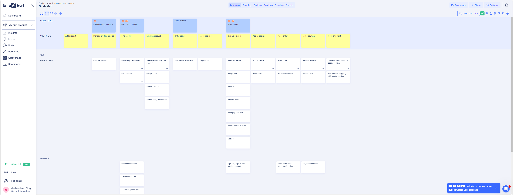
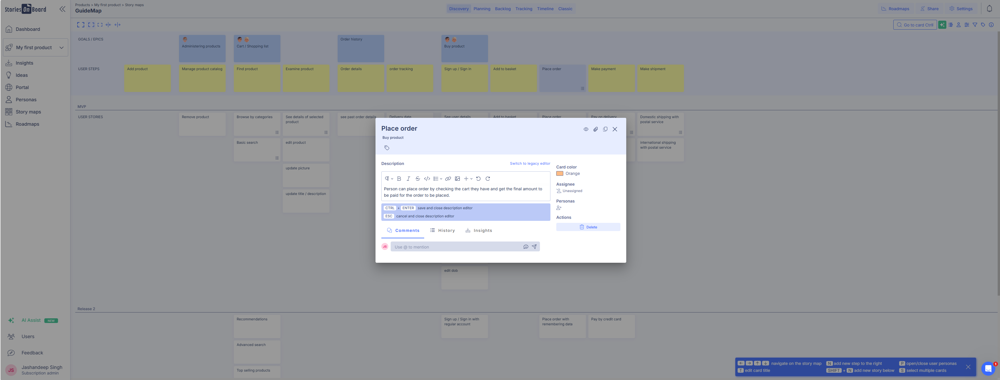

I thought of including the main steps and features needed in a grocery delivery app that are browse, pay, track and record. 

1. I chose 4 epics, namely cart/ shopping list, order history and buy product to keep it short and later expanded these.
2. I added various tasks in mvp like add to basket, edit basket, place order, payment method. These all are some of the important steps needed for the user to use the app and place an order.
3. I gave different estimates to each of the tasks varieing according to the priority of each and also the statuses.

Extra features that could be added to refine the user interface is adding filters for the search menu and placing order using past order / adding items to cart from last order which could help save the time of customer.

